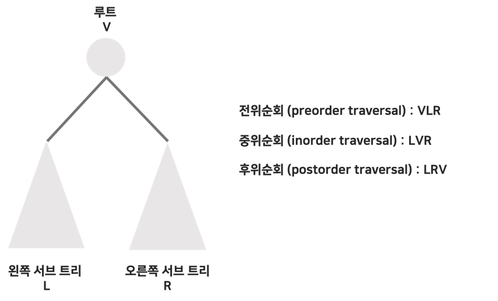
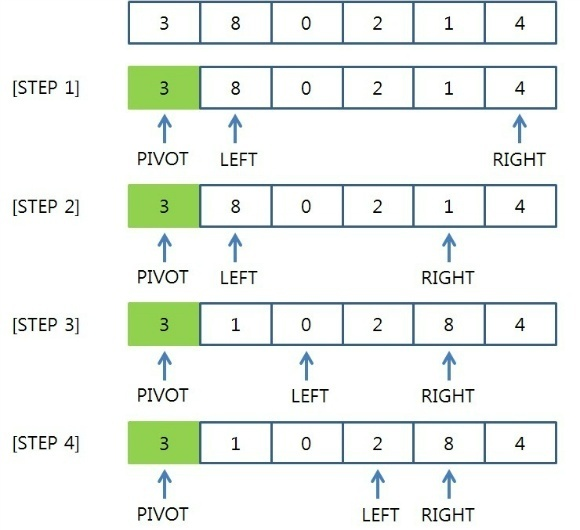

  
1. 스택과 큐에 대해 설명해주세요.

`스택`은 선입후출의 특성을 가진 자료구조입니다. 

- 스택을 구현하기 위해서는 배열, 연결리스트 사용이 가능하며, 주로 `배열`을 통해 구현합니다.

`큐`는 선입선출의 특성을 가진 자료구조입니다.

- 큐를 구현하기 위해서는 배열, 연결리스트 사용이 가능하며, 주로 `연결리스트`를 통해 구현합니다.

  
1-1. 스택과 큐가 실제로 사용되는 부분에 대해 설명해주세요.

`스택`이 실제로 사용되는 부분은 브라우저의 '뒤로가기' 기능이나, 메모리 영역의 스택 영역에 사용됩니다.

`큐`가 실제로 사용되는 부분은 프린터 큐, CPU 스케줄링의 Ready Queue 등에 사용됩니다.

  
1-2. 우선 순위 큐가 무엇인가요?

  
우선순위가 높은 원소가 우선적으로 빠져나오게 되는 자료구조입니다.

우선순위 큐는 배열, 연결리스트, Heap으로 구현할 수 있으며, 일반적인 경우에는 삽입과 삭제 연산이 모두 O(logN)이 보장된 `Heap` 자료구조를 사용해서 우선순위 큐를 구현합니다.

  
1-2. Heap이 무엇인가요?

  
- 힙(Heap)은 '`완전이진트리`'면서, `모든 부모노드와 자식노드 간에 '크거나 같은' 혹은 '작거나 같은'의 관계를 가지고 있는 트리`를 의미합니다.
- 우선순위에 따라 정렬 → 자바에서는 최소 힙
- 일반적으로 배열을 통해 구현
- 삽입 시 트리의 가장 마지막 노드 다음 인덱스에 새로운 노드를 집어넣고 Heapify 연산을 통해 힙으로 구성합니다.
- 삭제 시 트리의 루트노드를 반환 및 제거하고, 트리의 가장 마지막 인덱스를 가진 노드의 위치를 리프노드로 이동시킵니다. 그 후 Heapfiy 연산을 통해 다시 힙으로 구성합니다.
- 삽입과 삭제 연산 모두 트리의 높이에 따라 연산횟수가 결정되며, worst case의 시간 복잡도는 둘 다 O(log N)을 보장합니다.

---

- 이진트리는 `자식노드를 최대 2개까지 가질 수 있는 트리`를 의미하며, 완전이진트리는 리프노드 레벨을 제외한 나머지 트리는 포화 이진트리의 구조를 갖고, 리프노드 레벨의 노드들은 왼쪽 인덱스부터 차례로 채워진 트리를 의미합니다.
- 포화 이진 트리는 리프노드들을 제외한 나머지 노드들은 모두 자식을 2개를 가지며, 리프노드들은 자식을 갖지 않는 트리를 의미합니다.

  
1-3. Heap과 이진탐색트리의 차이점이 뭘까요?

  
<Heap>

- 우선순위에 따라 정렬
- 힙 트리에서는 중복된 값을 허용한다.
- 우선순위 큐와 같은 우선순위 기반 알고리즘에 사용
- 힙에서의 삽입, 삭제, 최대/최소값 검색은 보통 O(log n)의 시간 복잡도

<이진탐색트리>

- 값에 따라 정렬
- 이진 탐색 트리에서는 중복된 값을 허용하지 않는다.
- 데이터의 검색, 삽입, 삭제가 자주 발생하는 경우에 유용
- 이진 검색 트리에서의 삽입, 삭제, 검색은 평균적으로 O(log n)의 시간 복잡도를 가지지만, 최악의 경우에는 `트리가 편향되어 O(n)의 시간 복잡도`를 가질 수 있습니다.

  
1-4. 스택을 이용해 큐를 만드는 방법을 설명해보세요.

  
스택 2개와 데이터 {1, 2, 3, 4, 5}가 있다고 가정한다.

첫번째 스택에 데이터를 삽입한다. 그러면 {5, 4, 3, 2, 1} 순서로 삽입된다.

두번째 스택에 데이터를 삽입한다. 그러면 {1, 2, 3, 4, 5} 순서로 삽입된다. 

큐는 선입선출이므로 큐에 데이터를 넣으면 5, 4, 3, 2, 1 순서로 출력된다.

스택 2개를 이용한 방법도 마찬가지로 두번째 스택에서 데이터를 꺼내면 5, 4, 3, 2, 1 순서로 출력된다.

  
1-5. 스택을 단순히 뒤집으면 되는데, 굳이 스택 2개를 사용하는 이유가 있을까요?

  
원소를 추출할 때마다 스택을 뒤집는 것은 시간 복잡도가 O(n)이므로, 많은 원소가 있는 큐에서는 성능 저하가 발생할 수 있습니다.

반면에 두 개의 스택을 사용하는 방법은 원소를 삽입할 때와 추출할 때의 시간 복잡도가 모두 O(1)입니다. 큐의 동작을 보다 효율적으로 수행할 수 있습니다.

따라서 스택을 뒤집어서 큐를 구현하는 방법은 단순하지만, 성능 측면에서는 두 개의 스택을 사용하는 방법이 더 효율적입니다.

  
1-6. 삽입 연산 횟수와 삭제 연산 횟수가 100회 정도 차이나는 경우가 있어요. 이 경우에는 힙으로 구현하는게 좋을 것 같나요 아니면 연결리스트로 구현하는 것이 좋을 것 같나요?

  
처음 데이터를 삭제하는 경우 연결리스트는 O(1)이고, 중간 데이터를 삭제하는 경우 O(N)입니다. heap은 삭제 연산의 시간복잡도가 O(log N)입니다. 
처음 데이터를 삭제하는 상황이 많으면 연결리스트가 더 좋고,
중간 데이터를 삭제하는 경우가 많으면 heap이 더 좋습니다.

---

  
2. HashMap에 대해 설명해주세요.

  
Key-Value 쌍으로 값을 저장하는 자료구조로, 검색 시간 복잡도로 Θ(1)를 갖고 있는 것이 특징입니다.

  
2-1. 해시 맵(HashMap)의 검색 시간 복잡도는 어떻게 O(1)을 유지할 수 있나요?

  
해시 테이블에 Key로 접근하면, Hash Function에 Key 값을 집어 넣어 나온 Hash 값을 저장소의 인덱스로 활용합니다. 해당 인덱스에 값을 저장하기 때문에, Hash Function의 시간 복잡도를 제외하면 시간 복잡도 O(1)을 보장할 수 있습니다.

  
2-2. Hash Collision (해시 충돌)에 대해 설명할 수 있나요? 

  
해시 테이블에 접근하는 Key 값은 무한하고, Hash Function을 통해 나온 Hash 값은 유한합니다. (값이 저장되는 메모리는 한계가 있으므로.)

Key는 무한하고 Hash 는 유한하므로 특정 Hash Index에 대해서 겹치는 Key가 존재할 수 밖에 없습니다.

이렇게 `서로 다른 Key에 대해 같은 해시값을 갖는 경우`를 해시 충돌이라고 합니다.

  
2-3. 해시 충돌을 해결하는 방법에 대해 설명해주세요.

  
- 체이닝(Chaining) : 인덱스의 버킷을 연결리스트로 구현해, 이미 값이 존재하더라도 연결리스트에 해당 값을 삽입하는 방식
- 개방주소법(Open Addressing) : 해시 충돌이 일어난 경우, 특정한 간격만큼 이동 후 비어있는 주소 값에 저장하는 방식

  
2-4. 체이닝 방식과 개방주소법의 장단점에 대해 설명해주세요.

**체이닝 방식**

장점 :

1) 한정된 저장소(Bucket)을 효율적으로 사용할 수 있다.

2) 해시 함수(Hash Function)을 선택하는 중요성이 상대적으로 적다.

3) 상대적으로 적은 메모리를 사용한다. 미리 공간을 잡아 놓을 필요가 없다.

단점 :

1) 한 Hash에 자료들이 계속 연결된다면(쏠림 현상) 검색 효율을 낮출 수 있다.

2) 외부 저장 공간을 사용한다.

3) 외부 저장 공간 작업을 추가로 해야 한다.

**개방주소법 방식**

장점 :

1) 또 다른 저장공간 없이 해시테이블 내에서 데이터 저장 및 처리가 가능하다.

2) 또 다른 저장공간에서의 추가적인 작업이 없다.

단점 :

1) 해시 함수(Hash Function)의 성능에 전체 해시테이블의 성능이 좌지우지된다.

2) 데이터의 길이가 늘어나면 그에 해당하는 저장소를 마련해 두어야 한다.

  
2-5. 해시맵의 단점은 어떤 것이 있을까요?

  
단일 검색에는 O(1)의 성능을 보이지만, 범위 검색에서는 풀스캔과 같아 O(N)의 성능을 보입니다.

---

  
3. 트리에 대해 설명해주세요.

각 요소를 나타내는 노드와 노드 사이의 관계를 나타내는 자료구조이다.
- 사이클이 없어야한다.

  
3-1. 이진트리의 전위, 중위, 후위 순회에 대해 설명해주세요.

- 루트를 방문하는 작업을 V
- 왼쪽 서브 트리 방문을 L
- 오른쪽 서브트리 방문을 R

전위순회 : VLR  
중위순회 : LVR  
후위순회 : LRV  

  
3-2. BST (Binary Search Tree)와 BST의 특징에 대해 설명할 수 있나요?

- 이진 트리 (자식을 최대 2개까지 가질 수 있는 트리)
- 루트노드에 대해서 왼쪽 자식은 루트 노드보다 더 작은 값을, 오른쪽 자식은 루트 노드보다 더 큰 값을 저장한다.
- 루트노드의 왼쪽 서브트리, 오른쪽 서브트리에 대해 위의 조건을 만족한다.

`탐색에 유리`한 자료구조로, 특정 값에 대해 탐색하는 시간 복잡도가 트리의 높이에 의존하기 때문에 평균적으로 O(log N)의 시간복잡도를 갖습니다.

  
3-3. 이진탐색트리의 탐색 성능이 낮아지는 경우에 대해 설명해주세요.

이진탐색트리의 왼쪽 서브 트리와 오른쪽 서브 트리의 균형이 맞지 않고 한 쪽으로만 치우쳐진 경우에는 트리의 높이 자체가 N이 되므로 Worst Case의 경우 O(N)의 시간복잡도를 갖습니다.

  
3-4. 이진탐색트리의 성능을 개선하려면 어떻게 해야할까요?

BST의 양쪽 높이의 균형을 맞추는 것이 성능을 개선하는 방식입니다. AVL 트리, Red-Black 트리가 있습니다

---

  
4. Array와 List의 차이에 대해 설명해주세요.

  
- 배열은 크기가 고정되어 있고 연속된 메모리 공간에 요소를 저장합니다.
- 리스트는 크기가 가변적이고 연결 리스트 구조로 요소를 저장합니다.
- 배열은 인덱스로 빠르게 요소에 접근할 수 있지만, 리스트는 순회를 통해 요소에 접근해야 합니다.
- 배열은 동일한 자료형의 요소들을 저장하고, 리스트는 다양한 자료형의 요소들을 함께 저장할 수 있습니다.

  
4-1. Array와 LinkedList가 각각 무엇인지, 어떻게 다른지 설명해주세요.

  
<Array>

- 순서가 있는 데이터를 저장하기 위한 선형 자료구조
    - 고정 길이의 크기를 가진다.
- 인덱스를 통해 데이터를 탐색하면 O(1)
- 데이터 삽입, 삭제 O(N)

<LinkedList>

- 데이터를 저장하고 있는 각 노드를 서로 연결 시켜 만든 선형 자료구조
    - 가변 길이의 크기를 가진다.
- 특정 데이터 탐색은 O(N)
- 데이터 삽입 O(1)
- 데이터 삭제는 첫 번째 노드는 O(1), 그 외는 O(N)

---

  
5. 퀵정렬에 대해서 설명해주세요.

- 퀵 정렬은 빠른 정렬 속도를 자랑하는 분할 정복 알고리즘 중 하나로 피봇을 설정하고 피봇보다 큰 값과 작은 값으로 분할하여 정렬 합니다.
- 시간 복잡도는 O(n log n)이며 worst case 경우 O(n^2)까지 나빠질 수 있습니다.

  
5-1. 퀵정렬의 최악의 경우는 O(n^2)인데 왜 이 상황이 발생할까요?

퀵 정렬의 최악의 경우 시간 복잡도인 O(n^2)는 주로 이미 정렬된 배열이나 거의 정렬된 배열에 대해서 발생합니다. 이는 피벗을 선택할 때 항상 최소값이나 최대값을 선택하거나, 분할을 할 때 항상 한쪽으로 치우쳐서 분할이 이루어지는 경우에 발생합니다.

  
5-2. 퀵정렬의 최악의 경우는 O(n^2)인데, 이 문제를 해결하는 방법이 있을까요?

1. 랜덤한 피벗 선택: 피벗을 랜덤하게 선택하여 최악의 경우를 피할 수 있습니다. 이렇게 하면 평균적으로는 더 나은 성능을 얻을 수 있습니다.

2. 중간값 피벗 선택: 배열에서 중간값을 선택하여 피벗으로 사용하는 방법도 있습니다. 이렇게 하면 배열이 이미 정렬되어 있을 경우에도 최악의 경우를 피할 수 있습니다.

---
