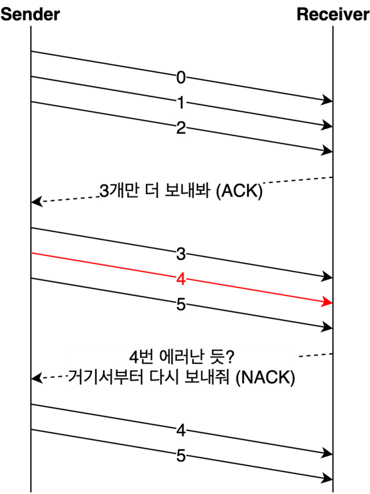

  
1. OSI 7계층에 대해 설명해주세요.

  
- 7계층 (Application Layer, 응용계층) : 최종 목적지로 응용 프로그램과 연관해 서비스를 수행하는 계층입니다. HTTP, FTP, DNS등이 7계층에 속합니다.
- 6계층 (Presentation Layer, 표현계층) : 데이터 압축 혹은 변환이 이뤄지는 계층으로, 데이터의 형식을 정의합니다. JPEG, MPEG등이 6계층에 속합니다.
- 5계층 (Session Layer, 세션계층) : 데이터가 통신하기 위한 논리적 연결을 담당하는 계층으로, 세션을 생성해 통신합니다. API나 Socket이 5계층에 속합니다.
- 4계층 (Transport Layer, 전송계층) : 종단 간 사용자들에게 신뢰성있는 데이터를 전달하는 계층입니다. 각 데이터의 단위는 세그먼트입니다. TCP와 UDP가 4계층에 속합니다.
- 3계층 (Network Layer, 네트워크계층) : IP를 지정하고 라우터로 경로를 선택해 네트워크를 통해 데이터를 전달하는 계층입니다. 각 데이터의 단위는 패킷입니다. Router가 3계층에 속합니다.
- 2계층 (Datalink Layer, 데이터링크계층) : 신뢰성 있는 전송을 위해 에러 검출, 흐름제어를 담당하며 데이터의 물리적인 전송이 일어나는 계층입니다. 데이터의 단위는 프레임입니다. Ethernet이 2계층에 속합니다.
- 1계층 (Physical Layer, 물리계층) : 데이터를 전기 신호로 변경하는 계층으로, 데이터 단위는 비트입니다.

  
1-1. TCP/IP 4계층에 대해 설명해주세요.

  
1-2. OSI 7계층과 TCP/IP 4계층 차이는 무엇인가요?

OSI 7계층 : `데이터 통신`에 필요한 계층과 역할을 정확하게 정의하려고 한 모델

TCP/IP : `인터넷에서 사용되는 프로토콜`로, 좀 더 실무적이면서 프로토콜 중심으로 단순화된 모델

---

  
2. 전송계층과 데이터링크 계층 모두 신뢰성 관련 기능을 제공하는데, 어떤 차이가 있나요?

1. 전송계층은 논리적 연결 (종단간 호스트) / 데이터링크 계층은 물리적 연결 (인접한 노드 or 호스트)

- 전송계층은 논리적으로 연결된, 종단간의 호스트에 신뢰성 관련 기능(흐름제어, 혼잡제어, 오류제어)를 제공합니다.

- 데이터링크 계층은 물리적으로 연결된 호스트 사이의 전송으로 직접 묶여있는 호스트-노드 혹은 노드-노드 간의 신뢰성 관련 기능(오류제어, 흐름제어, 회선제어)를 제공합니다.

2. 전송 계층은 주로 프로세스 간 통신을 관리하고, 데이터 링크 계층은 주로 네트워크 하드웨어 간의 통신을 관리합니다.

  
2-1. 전송계층이 데이터 분실을 확인하는 방법에 대해 설명해주세요.

  
전송계층에선 데이터를 패킷단위로 쪼개어 같은 목적지로 전송합니다. 패킷에 각각 번호를 부여해 목적지에서 패킷을 재조립해서 패킷의 분실 여부를 확인합니다.

  
2-2. 전송계층이 제공하는 신뢰성 관련 기능 중, 흐름제어에 대해 설명해주세요.

  
송신측과 수신측 사이의 데이터 처리 속도를 제어하기 위해서 송신측의 데이터 처리 속도를 조절합니다. 그 결과 수신자의 `버퍼 오버플로우를 방지`할 수 있습니다.

흐름제어 기법으로 `슬라이드 윈도우`를 사용합니다.

슬라이드 윈도우 크기 만큼 패킷을 전송하고 수신자에게서 ACK가 오지 않으면 윈도우를 오른쪽으로 이동하지 않습니다.

전송된 패킷을 잘 받았다는 ACK신호가 수신자로부터 송신자로 돌아오면 ACK의 수만큼 오른쪽으로 슬라이딩 윈도우가 이동합니다.

이러한 로직을 통해 한 번에 다량의 패킷이 전송되어 수신자의 버퍼가 오버플로우되는 현상을 막을 수 있습니다.

  
2-3. 전송계층이 제공하는 신뢰성 관련 기능 중, 오류제어(재전송 프로토콜)에 대해 설명해주세요.

  
오류제어는, 패킷이 손상되었거나 손실된 경우, 재전송을 통해 오류를 복구할 수 있는 방법으로 재전송 프로토콜이라고도 부릅니다.

재전송 프로토콜은 크게 3가지가 있습니다. 재전송은 비효율적이므로 적을수록 좋은 알고리즘입니다.

1) Stop and Wait

`ACK를 받고 나서 다음 데이터를 보내는 방식`입니다. 흐름제어에서의 슬라이딩윈도우를 사용하지 못하므로, 더욱 더 효율적인 재전송 프로토콜이 필요합니다.

2) Go-Back-N

`연속으로 데이터를 보내다가, 오류가 발생한 지점부터 재전송`하는 프로토콜입니다. 성공적으로 전송된 데이터까지 재전송하기 때문에 조금 비효율적인 측면이 있습니다.

3) Selective Repeat (SR)

`오류가 발생한 데이터만 재전송`하는 방식입니다. 다만, 수신 측 버퍼의 `데이터가 순차적이지 않다`는 것이 단점입니다. `정렬의 과정이 추가로 필요`하고, 별도의 버퍼가 필요합니다. 따라서 Go-Back-N 재전송 프로토콜과 비교하여 상황에 맞게 사용하는 것이 좋습니다.

  
2-4. 전송계층이 제공하는 신뢰성 관련 기능 중, 혼잡제어에 대해 설명해주세요.

  
네트워크의 혼잡을 피하기 위해 송신측에서 보내는 데이터의 전송 속도를 제어하는 것입니다.

여기서 혼잡은, 네트워크 내에 패킷의 수가 과도하게 증가하는 현상을 의미합니다.

이러한 혼잡 현상을 방지하고 제거하기 위한 기능이 혼잡제어 입니다.

1) AIMD 방식 (Additive Increase / Multiplicative Decrease)

- 처음 패킷 하나를 보내 문제가 없다면 Window Size를 1씩 증가시키는 방식
- 문제가 발생하면 Window Size를 절반으로 줄인다.
- 초기에 높은 대역폭을 사용하지 못하여 오랜 시간이 걸리고 네트워크가 혼잡해지는 상황을 미리 감지하지 못한다.

2) Slow Start 방식

- 처음 패킷을 하나씩 보내는 것은 같지만 매 전송마다 2배씩 증가하여 데이터의 크기가 지수함수적으로 증가한다.
- 전송되는 데이터의 크기가 임계값에 도달하면 혼잡 회피 단계로 넘어간다.
- 혼잡 현상이 발생하면 Window size를 1로 줄인다.
- 혼잡 현상이 발생했던 Window Size 절반 까지는 지수함수 꼴로 증가하고 이후부터는 1씩 증가한다.

3) Fast Recovery 방식

- 혼잡 시 1로 줄이지 않고 절반으로 줄이고 선형 증가시키는 방식
- 혼잡 상황을 한 번 겪은 이후로는 AIMD 방식으로 동작합니다.

---

  
3. HTTP Method에는 어떤 것들이 있는지 설명해주세요.

| GET | 조회, 리소스 요청 |
| --- | --- |
| POST | 요청된 데이터를 처리하고 자원을 생성함 |
| PUT | 요청된 자원이 없으면 생성, 있으면 새 것으로 전체 갱신 |
| PATCH | 자원의 일부분만 수정 |
| DELETE | 요청된 자원을 삭제 |

  
3-1. PUT과 PATCH의 차이는 무엇인가요?

  
PUT은 전체 리소스를 수정하는 데 사용되고, PATCH는 리소스의 일부를 수정하는 데 사용됩니다.

  
3-2. PUT은 전체 리소스를 수정하는데 사용됩니다. 그렇다면 PUT 메서드를 사용할 때, 일부 리소스만 변경하고 나머지 리소스에 데이터를 넣지 않는다면 어떻게 될까요?

  
보내지 않은 데이터에 대해서는 null 값으로 변한다.

  
3-3. 멱등성에 대해 설명해주세요.

  
특정 메소드를 여러번 요청했는데, 매번 요청 결과가 같은 경우 해당 메소드를 멱등성 메소드라고 부릅니다.

---

  
4. http 상태코드를 아는대로 설명해주세요.

2XX(성공)

- 200(OK) : 요청 성공
- 201(Created) : 새로운 리소스 생성
- 204(No content) : 처리는 성공했지만 클라이언트에게 돌려줄 콘텐츠가 없다.

3XX(리다이렉트)

- 301 : 지정한 리소스가 새로운 URI로 이동함

4XX (클라이언트 에러)

- 400(Bad Request) : 요청의 구문이 잘못되었다.
- 401 (권한 없음)
- 403 (Forbidden) : 지정된 리소스에 대한 접근 금지(권한 제외)
- 404(Not Found) : 지정한 리소스를 찾을 수 없다.

5XX (서버에러)

- 500 : 내부 서버 오류
- 502(Bad Gateway) : 게이트웨이 또는 프록시 역할을 하는 서버가 그 뒷단의 서버로부터 잘못된 응답을 받았다.

  
4-1. 401과 403의 차이에 대해 설명해주세요.

  
□ HTTP 상태 코드 401(Unauthorized)

그 중에서도 401(Unauthorized)는 클라이언트가 `인증되지 않아` 정상적으로 요청을 처리할 수 없고 해당 리소스에 대한 인증이 필요하다는 의미의 상태코드이다.

401 코드를 응답받는 대표적인 경우는 로그인을 하지 않고 특정 리소스를 요청하는 경우이다.

□ HTTP 상태 코드 403(Forbidden)

이와 다르게 403(Forbidden)에러 코드는 서버가 클라이언트의 요청을 이해했지만 승인을 거부한 상태로 주로 인증 자격은 있지만 `접근 권한이 없는 경우`를 알려준다. 예를들어 일반 사용자가 로그인을 하여 `인증은 되었지만 접근 권한이 없는` admin(관리자)등급의 리소스를 요청하는 경우이다.

  
4-2. http 버전 별 특징에 대해 설명해주세요. (0.9, 1.0, 1.1, 2.0)

  
**HTTP 0.9**

- 메소드가 get밖에 없다.
- html 파일 자체를 보내주는 기능만 한다.

**HTTP 1.0**

- 헤더가 생겼다. → http 버전 정보, 상태 코드 등 추가적인 정보 전송이 가능하다.
- Content-Type을 이용해 html 외에 다른 타입의 파일도 전송 가능하다.
- 매번 `요청마다 커넥션을 수립`하는 과정을 반복한다. 새로운 연결이 반복되어 성능이 저하되고 서버 부하가 커지는 문제가 발생한다.

**HTTP 1.1**

- http/1.1부터는 `keepAlive`라는 기능이 추가되어 `연결이 한번 수립되면 데이터 교환을 마칠 때까지 유지하고, 데이터 교환이 끝나면 연결을 끊는 구조`이다.
- **Pipelining**이 도입됐다. 요청에 대한 응답을 기다리지 않고 여러 요청을 연속적으로 보내서 그 순서에 맞춰서 응답을 받는 방식이다. 하지만 이런 방식은 먼저 보낸 요청을 서버에서 처리하는데 시간이 오래 걸린다면 그 뒤의 요청도 기다려야만 하는 **Head Of Line Blocking** 현상이 생기게 된다.
    - Head Of Line Blocking : 네트워크에서 같은 큐에 있는 패킷이 첫번째 패킷에 의해 지연될 때 발생하는 성능 저하 현상

**HTTP 2.0**

- 기존의 일반 텍스트 형식의 데이터를 바이너리로 인코딩하여 `프레임` 단위로 분할하여 보내게 된다.
- 프레임 단위로 쪼갰기 때문에 메세지간의 순서가 사라지게 된다.
- 전송 리소스 간에 `우선순위`를 설정할 수 있다.
- multiplexing 가능 → 동시에 여러 요청 처리

---

  
5. DNS가 무엇인가요?

Domain Name Server의 약어로, IP주소를 문자로 표현한 주소로 바꾸는 시스템 혹은 서버를 의미합니다.

  
5-1. www.google.com  도메인을 브라우저에 입력했을 때 일어나는 일을 순차적으로 설명해주세요.

1) www.google.com을 브라우저 주소창에 입력합니다.

2) 브라우저는 캐싱된 DNS 기록(브라우저 캐시, OS 캐시, 라우터 캐시, ISP 캐시)을 통해 해당 도메인 주소에 대응되는 IP주소가 있는지 확인합니다.

3) 요청한 URL이 캐시에 없는 경우, ISP의 DNS 서버가 www.google.com을 호스팅하고 있는 서버의 IP주소를 찾기 위해 DNS Query를 보내 찾습니다.

4) 브라우저는 www.google.com에 해당하는 IP 주소를 획득해 해당 서버와 TCP 연결을 시도합니다. (3-way handshake)

5) TCP 연결이 완료되면, 브라우저가 웹 서버에 HTTP Request를 보냅니다.

6) 서버는 해당 Request를 처리하고 Response를 생성해 브라우저에게 보냅니다.

7) 브라우저는 해당 Response를 읽어들여 사용자에게 보여줍니다.

  
5-2. TCP Connection 시 3-way handshaking을 한다고 했는데, 이에 대해 설명해주시겠어요?

  
TCP는 신뢰성있는 전송을 위해 1:1로 서로 잘 `연결되었음을 확인`하는 과정을 거칩니다. 이 과정이 바로 3-way handshaking이라고 부릅니다.

1. Client가 Server에게 접속 요청 SYN 패킷을 보냅니다.
2. 서버는 SYN 패킷을 받고, 해당 요청을 수락하는 ACK와 Client와 연결하겠다는 SYN 패킷을 동시에 보냅니다.
3. Client는 서버에게 확인 응답으로 ACK 패킷을 보냅니다.

  
5-3. 그렇다면 TCP Connection을 해제하는 경우는 어떻나요?

  
3-way handshaking이 아닌, `4-way handshacking`을 진행합니다.

1. Client가 Server에게 FIN 신호를 보냅니다.
2. Server는 Client가 보내온 FIN 신호에 응답하는 ACK 신호를 보냅니다.
3. Server는 Client에게 FIN 신호를 보냅니다.
4. Client는 Server가 보내온 FIN 신호에 응답하는 ACK 신호를 보냅니다.

  
5-4. 연결해제 시 4-way handshacking을 사용하는 이유는 무엇인가요?

  
 Client는 Server에게 데이터 요청을 모두 보냈다하더라도, Server는 Client에게 보내야 할 데이터가 남아있을 수 있기 때문에 FIN과 ACK를 한 번에 보내지 않고, 서버 측에서 보낼 데이터 마저 다 보냈을 경우 FIN 메시지를 보낸다.

---
